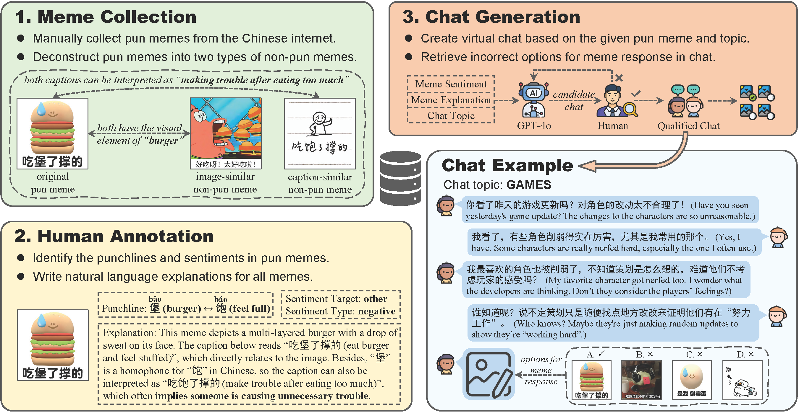

# PUNMEMECN: A Benchmark to Explore Vision-Language Models’ Understanding of Chinese Pun Memes

## Overview
Pun memes, which combine wordplay with visual elements, represent a popular form of humor in Chinese online communications. Despite their prevalence, current Vision-Language Models (VLMs) lack systematic evaluation in understanding and applying these culturallyspecific multimodal expressions.

In this paper, we introduce **PUNMEMECN**, a novel benchmark designed to assess VLMs’ capabilities in processing Chinese pun memes across three progressive tasks: pun meme detection, pun meme sentiment analysis, and chat-driven meme response. PUNMEMECN consists of 1,959 Chinese memes (653 pun memes and 1,306 non-pun memes) with comprehensive annotations of punchlines, sentiments, and explanations, alongside 2,008 multi-turn chat conversations incorporating these memes.

Our experiments indicate that state-of-the-art VLMs struggle with Chinese pun memes, particularly with homophone wordplay, even with Chain-of-Thought prompting. Notably, punchlines in memes can effectively conceal potentially harmful content from AI detection. These findings underscore the challenges in cross-cultural multimodal understanding and highlight the need for culture-specific approaches to humor comprehension in AI systems.

Paper: [here](https://aclanthology.org/2025.emnlp-main.944.pdf)




## Dataset

All data for **PUNMEMECN** is located in the `./pun_meme/cn` folder.

- You can find all meme annotations in `_Meta.json`, including meme type (pun/non-pun), text caption, sentiment, explanation, etc.;

- Chat contexts and meme options are in `_Chat(easy).json` and `_Chat(hard).json`.


## Citation
If you find this benchmark useful for your works, please cite the following paper:
```
@inproceedings{xu2025punmemecn,
  title={PUNMEMECN: A Benchmark to Explore Vision-Language Models’ Understanding of Chinese Pun Memes},
  author={Xu, Zhijun and Yuan, Siyu and Zhang, Yiqiao and Sun, Jingyu and Zheng, Tong and Yang, Deqing},
  booktitle={Proceedings of the 2025 Conference on Empirical Methods in Natural Language Processing},
  pages={18705--18721},
  year={2025}
}
```
